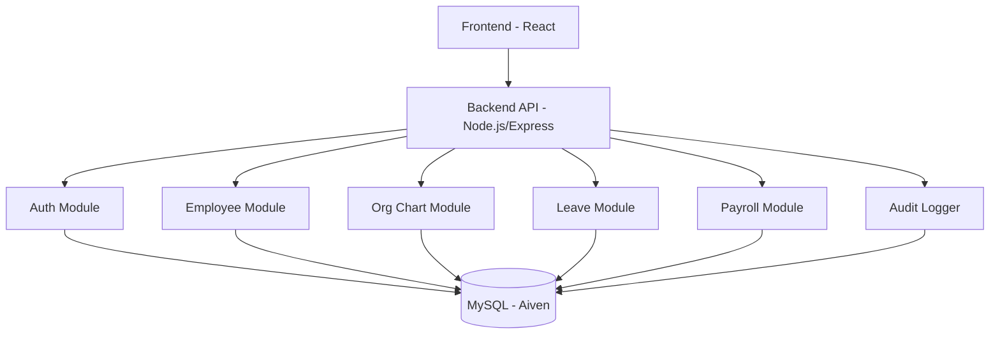
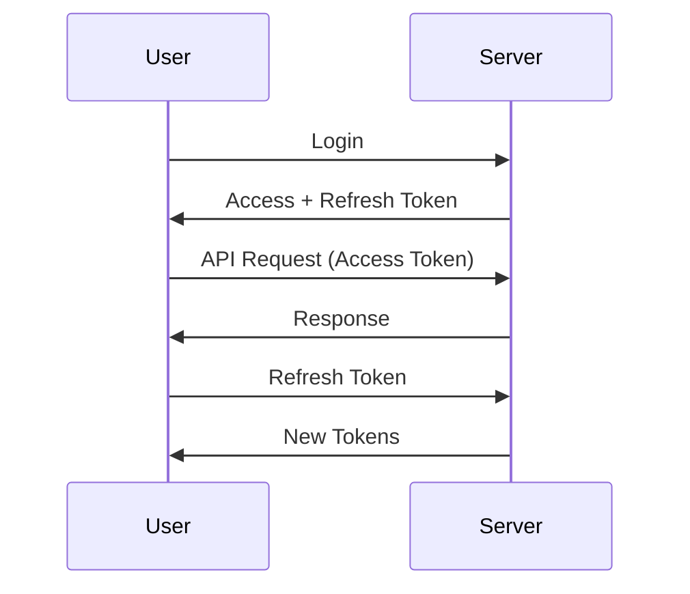

---

# 🧑‍💼 HRMS – Human Resource Management System

### 🚀 Portfolio Edition | ICT2504C Full Stack Secured Development

## 🎯 Overview

A **production-style Human Resource Management System (HRMS)** built with a strong emphasis on
**security, modular design, and real-world HR workflows**.

Supports Admins, Managers, and Employees with:

* Secure authentication & access control
* Employee lifecycle management
* Organizational hierarchy tracking
* Performance evaluation
* Payroll and salary processing
* Full audit logging

---

## ✨ Core Features

### 🔐 Authentication & Security

* JWT-based authentication (Access + Refresh Tokens)
* Refresh Token Rotation (single-use tokens)
* bcrypt password hashing
* Brute-force protection (account lock)
* Role-based access control (RBAC)

---

### 👤 Employee Management

* Admin onboarding
* Profile updates
* Role assignment

---

### 🌳 Org Chart & Performance Management

* Hierarchical reporting structure
* Org chart visualization (tree structure)
* Manager-only performance rating system
* Rating scale (1–5 + comments)
* Circular dependency prevention

---

### 📅 Leave Management

* Leave application & approval
* Validation (no overlaps, no past dates)
* Leave balance tracking

---

### 💰 Payroll System

* Salary versioning (historical tracking)
* Monthly payroll generation
* Payslip breakdown
* Immutable payroll records

---

### 📊 Audit & Monitoring

* Login tracking
* Payroll actions
* Account changes
* Admin activity logs

---

## 🧠 System Architecture



---

## 🔐 Authentication Flow



---

## 🛠 Tech Stack

| Layer    | Technology          |
| -------- | ------------------- |
| Frontend | React (Vite), Axios |
| Backend  | Node.js, Express    |
| Auth     | JWT, bcrypt         |
| Database | MySQL (Aiven Cloud) |

---

## ⚙️ Setup

```bash
git clone <repo url>
cd hrms
```

Paste the provided separate `.env` file in /backend:

```
The .env shall be provided separately upon request. The .env file is essential for the connection to the shared database, establishing localhost connection, and employee credentials
```

---

## ▶️ Run

```bash
launch-windows.bat (for Windows)
launch-mac.command (for Mac)
```

or manually:

```bash
cd backend && npm install && npm run dev
cd frontend && npm install && npm run dev
```

---

## 🌐 Access

Frontend: [http://localhost:5173](http://localhost:5173)
Backend: [http://localhost:3001](http://localhost:3001)

---

## 🔐 Demo Credentials

```
adminnew@hrms.com
Admin123!
```

